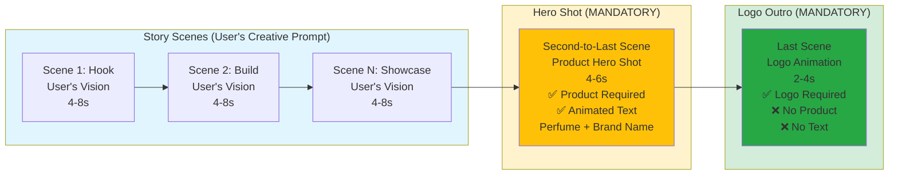
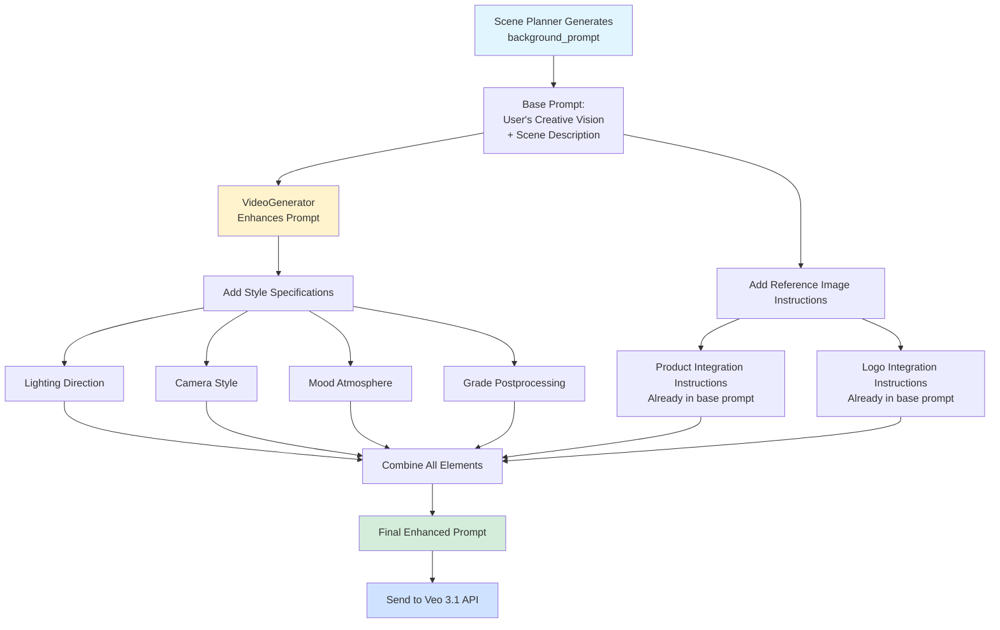
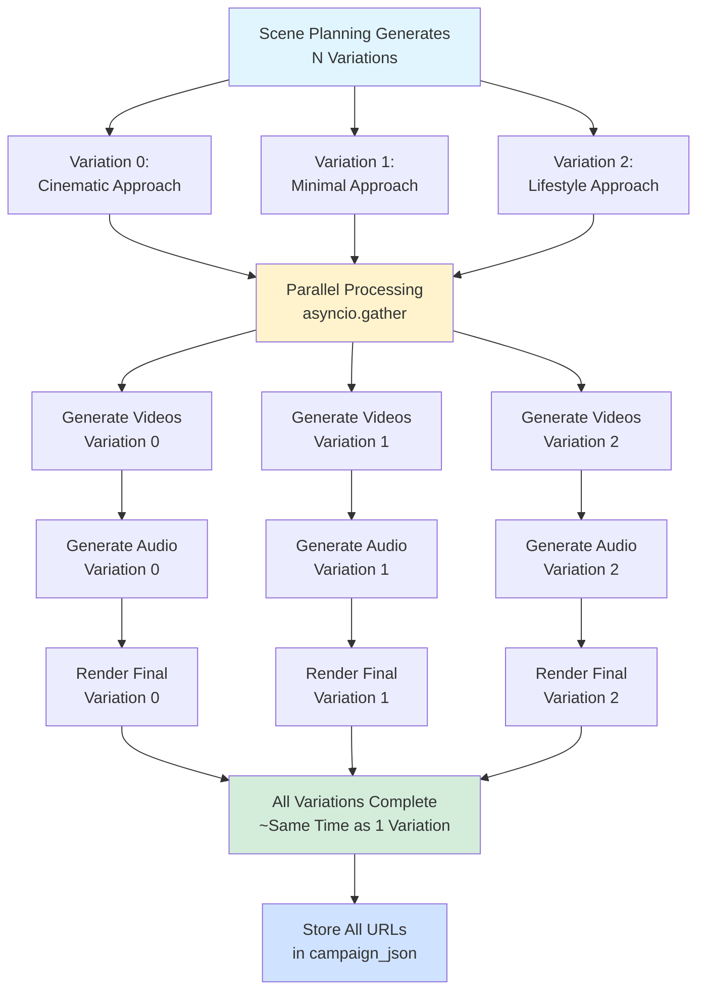

# Video Generation Pipeline Flow Documentation

## Overview

This document describes the complete flow of the GenAds video generation pipeline, from when a user submits a creative prompt to when they receive a fully generated luxury perfume advertisement video.

The pipeline is a **5-step process** that transforms a user's creative vision into a professional video advertisement using:
- **LLM-based scene planning** (GPT-5.1)
- **AI video generation** (Google Veo 3.1)
- **AI music generation** (MusicGen)
- **Video compositing and rendering** (FFmpeg)

---

## High-Level Flow

### Complete Pipeline Flow Diagram

```mermaid
flowchart TD
    Start([User Submits Creative Prompt]) --> CreateCampaign[Campaign Creation API]
    CreateCampaign --> DB1[(Database: Campaign Created)]
    DB1 --> Enqueue[Enqueue Generation Job]
    Enqueue --> RQ[Redis Queue]
    RQ --> Worker[RQ Worker Picks Up Job]
    
    Worker --> Init[Initialize Pipeline]
    Init --> LoadData[Load Campaign/Perfume/Brand]
    LoadData --> InitStorage[Initialize Local Storage]
    
    InitStorage --> Step1{Product Image<br/>Available?}
    Step1 -->|Yes| Extract[Step 1: Product Extraction<br/>rembg background removal]
    Step1 -->|No| SkipExtract[Skip Product Extraction]
    Extract --> UploadProduct[Upload to S3]
    UploadProduct --> Step2
    SkipExtract --> Step2[Step 2: Scene Planning<br/>GPT-5.1 LLM]
    
    Step2 --> ExtractGuidelines[Extract Brand Guidelines]
    ExtractGuidelines --> PlanScenes[Generate Scene Plan<br/>USER-FIRST Philosophy]
    PlanScenes --> ValidateGrammar[Validate Grammar]
    ValidateGrammar --> GenStyle[Generate Style Spec]
    GenStyle --> StorePlan[Store Scene Plan to DB]
    
    StorePlan --> Step3[Step 3: Video Generation<br/>Veo 3.1]
    Step3 --> EnhancePrompts[Enhance Prompts with Style]
    EnhancePrompts --> GenVideos[Generate Scene Videos<br/>Parallel Processing]
    GenVideos --> UploadScenes[Upload Scene Videos to S3]
    
    UploadScenes --> Step4[Step 4: Audio Generation<br/>MusicGen]
    Step4 --> GenMusic[Generate Background Music]
    GenMusic --> UploadMusic[Upload Music to S3]
    
    UploadMusic --> Step5[Step 5: Final Rendering<br/>FFmpeg]
    Step5 --> DownloadAssets[Download Scenes + Audio]
    DownloadAssets --> Concat[Concatenate Scenes]
    Concat --> MixAudio[Mix with Audio]
    MixAudio --> Render[Render 16:9 Final Video]
    Render --> UploadFinal[Upload Final Video to S3]
    
    UploadFinal --> UpdateDB[Update Campaign Status]
    UpdateDB --> DB2[(Database: Campaign Completed)]
    DB2 --> Frontend[Frontend Displays Results]
    Frontend --> End([User Views Generated Video])
    
    style Start fill:#e1f5ff
    style End fill:#d4edda
    style Step1 fill:#fff3cd
    style Step2 fill:#cfe2ff
    style Step3 fill:#cfe2ff
    style Step4 fill:#cfe2ff
    style Step5 fill:#cfe2ff
    style DB1 fill:#f8d7da
    style DB2 fill:#f8d7da
    style RQ fill:#d1ecf1
```



### Scene Structure Flow Diagram



### Detailed Pipeline Steps Diagram

```mermaid
flowchart TD
    subgraph Phase1["Phase 1: Campaign Creation"]
        A1[User Submits Form] --> A2[POST /api/campaigns]
        A2 --> A3[Create Campaign Record]
        A3 --> A4[Return campaign_id]
    end
    
    subgraph Phase2["Phase 2: Job Enqueuing"]
        B1[User Clicks Generate] --> B2[POST /api/campaigns/{id}/generate]
        B2 --> B3[Enqueue to Redis Queue]
        B3 --> B4[Update Status: processing]
    end
    
    subgraph Phase3["Phase 3: Pipeline Execution"]
        C1[Worker Picks Up Job] --> C2[Initialize Pipeline]
        C2 --> C3[Load Campaign/Perfume/Brand]
        
        subgraph Step1["STEP 1: Product Extraction"]
            D1{Has Product?} -->|Yes| D2[Download Image]
            D2 --> D3[Remove Background rembg]
            D3 --> D4[Upload to S3]
            D4 --> D5[Return product_url]
            D1 -->|No| D6[Skip: product_url = None]
        end
        
        subgraph Step2["STEP 2: Scene Planning"]
            E1[Extract Brand Guidelines] --> E2[Build AdProject Schema]
            E2 --> E3[Generate Scene Plan GPT-5.1]
            E3 --> E4[Apply USER-FIRST Philosophy]
            E4 --> E5[Validate Grammar]
            E5 --> E6[Generate Style Spec]
            E6 --> E7[Store to Database]
        end
        
        subgraph Step3["STEP 3: Video Generation"]
            F1[For Each Scene] --> F2[Enhance Prompt]
            F2 --> F3[Add Style Specs]
            F3 --> F4[Add Reference Image Instructions]
            F4 --> F5[Call Veo 3.1 API]
            F5 --> F6[Generate Video]
            F6 --> F7[Upload to S3]
            F7 --> F8[Parallel: All Scenes]
        end
        
        subgraph Step4["STEP 4: Audio Generation"]
            G1[Calculate Total Duration] --> G2[Create Music Prompt]
            G2 --> G3[Call MusicGen API]
            G3 --> G4[Generate MP3]
            G4 --> G5[Upload to S3]
        end
        
        subgraph Step5["STEP 5: Final Rendering"]
            H1[Download All Scenes] --> H2[Download Audio]
            H2 --> H3[Concatenate Scenes FFmpeg]
            H3 --> H4[Mix with Audio]
            H4 --> H5[Render 16:9 Final Video]
            H5 --> H6[Upload to S3]
        end
        
        C3 --> Step1
        Step1 --> Step2
        Step2 --> Step3
        Step3 --> Step4
        Step4 --> Step5
    end
    
    subgraph Phase4["Phase 4: Completion"]
        I1[Update Campaign Status] --> I2[Store Video URLs]
        I2 --> I3[Return Pipeline Result]
    end
    
    Phase1 --> Phase2
    Phase2 --> Phase3
    Phase3 --> Phase4
    
    style Phase1 fill:#e1f5ff
    style Phase2 fill:#fff3cd
    style Phase3 fill:#cfe2ff
    style Phase4 fill:#d4edda
    style Step1 fill:#f8d7da
    style Step2 fill:#d1ecf1
    style Step3 fill:#d1ecf1
    style Step4 fill:#d1ecf1
    style Step5 fill:#d1ecf1
```

### Prompt Enhancement Flow Diagram



### Multi-Variation Parallel Processing Diagram



---

## Detailed Step-by-Step Flow

### Phase 1: Campaign Creation (Frontend → Backend API)

**Location:** `backend/app/api/campaigns.py`

1. **User submits campaign form** (frontend)
   - Creative prompt (user's vision)
   - Perfume selection
   - Video style selection (optional)
   - Target duration (15-60 seconds)
   - Number of variations (1-3)

2. **POST `/api/campaigns`** endpoint receives request
   - Validates input data
   - Verifies perfume ownership
   - Creates campaign record in database
   - Returns `CampaignDetail` with `campaign_id`

3. **Database record created:**
   ```sql
   Campaign {
     campaign_id: UUID
     perfume_id: UUID
     brand_id: UUID
     campaign_name: string
     creative_prompt: string
     selected_style: string
     target_duration: int
     num_variations: int (1-3)
     status: "pending"
     progress: 0
   }
   ```

---

### Phase 2: Generation Job Enqueued (API → RQ Queue)

**Location:** `backend/app/api/generation.py`

1. **User clicks "Generate" button** (frontend)

2. **POST `/api/campaigns/{campaign_id}/generate`** endpoint:
   - Verifies campaign ownership
   - Checks campaign status (must be `pending` or `failed`)
   - Enqueues job to Redis Queue (RQ)
   - Updates campaign status to `processing`

3. **RQ Job created:**
   ```python
   job = queue.enqueue(
       generate_video,
       args=(campaign_id,),
       job_timeout="1h"
   )
   ```

4. **Response returned:**
   ```json
   {
     "status": "queued",
     "job_id": "...",
     "message": "Generation job enqueued"
   }
   ```

---

### Phase 3: Background Worker Picks Up Job

**Location:** `backend/app/jobs/worker.py`

1. **RQ Worker** (running in separate process) picks up job from queue
2. **Worker calls** `generate_video(campaign_id)` function
3. **Function creates** `GenerationPipeline` instance
4. **Pipeline initialization:**
   - Loads campaign from database
   - Loads perfume (with images)
   - Loads brand (with logo, guidelines)
   - Initializes local storage paths
   - Verifies all relationships (brand → perfume → campaign)

---

### Phase 4: Pipeline Execution (5 Steps)

**Location:** `backend/app/jobs/generation_pipeline.py`

The pipeline runs asynchronously through 5 main steps:

#### **STEP 1: Product Extraction** (Optional)

**Service:** `ProductExtractor` (`backend/app/services/product_extractor.py`)

**Purpose:** Extract perfume bottle from background for use in video generation

**Process:**
1. Checks if perfume has `front_image_url`
2. If available:
   - Downloads perfume front image (from S3 or local)
   - Removes background using `rembg` library
   - Saves extracted product PNG to local storage
   - Uploads to S3: `brands/{brand_id}/perfumes/{perfume_id}/campaigns/{campaign_id}/draft/product/extracted.png`
   - Returns S3 URL of extracted product
3. If not available:
   - Skips extraction
   - `product_url = None`

**Output:**
- `product_url`: S3 URL of extracted product PNG (or `None`)

**Progress:** 0-10%

---

#### **STEP 2: Scene Planning** (LLM-Based)

**Service:** `ScenePlanner` (`backend/app/services/scene_planner.py`)

**Purpose:** Generate structured scene plan from user's creative prompt

**Process:**

1. **Build AdProject schema** from campaign data:
   ```python
   AdProject {
     creative_prompt: string
     brand: { name, logo_url, guidelines_url }
     target_duration: int
     perfume_name: string
     perfume_gender: string
     scenes: []  # Will be populated
     style_spec: {}  # Will be populated
   }
   ```

2. **Extract brand guidelines** (if available):
   - Downloads brand guidelines PDF from S3
   - Uses `BrandGuidelineExtractor` (GPT-4 Vision) to extract:
     - Color palette
     - Tone of voice
     - Dos and don'ts
   - Merges extracted colors into brand colors

3. **Generate scene plan** using GPT-5.1 with **USER-FIRST PHILOSOPHY**:

   **USER-FIRST PHILOSOPHY (CRITICAL):**
   
   The scene planner follows a strict priority hierarchy:
   
   1. **User's Creative Prompt (PRIMARY)** - The story, concept, emotion they want
   2. **Narrative Flow & Storytelling (CRITICAL)** - All scenes must connect as one cohesive story
   3. **Perfume Visual Language (SECONDARY)** - The cinematography style and execution quality
   4. **Veo S3 Technical Capabilities (TOOLS)** - How to achieve the vision
   
   **GOLDEN RULE:**
   - If user says "underwater scene with dolphins" → Create underwater scene with perfume cinematography
   - **NOT** force it into "silk fabric" just because that's in the grammar
   - The perfume shot grammar is a **VISUAL LANGUAGE LIBRARY**, not a strict rulebook
   - Grammar informs **HOW** to shoot scenes, not **WHAT** scenes to create
   
   **Example:**
   - User prompt: "Romantic Paris evening with Eiffel Tower"
   - Story scenes: Create romantic Paris evening scenes (cafe, Eiffel Tower, warm lighting)
   - Grammar application: Apply perfume cinematography (dolly shots, volumetric lighting, shallow DOF)
   - Result: User's vision + luxury execution
   
   **CRITICAL SCENE STRUCTURE RULES:**
   
   - **Story Scenes (All scenes EXCEPT second-to-last and last):**
     - These scenes **directly implement the user's creative prompt**
     - If user says "midnight garden with fireflies" → create midnight garden scene
     - If user says "ocean waves and freedom" → create ocean scene
     - Product appears **naturally in the story** (when appropriate)
     - Duration: 4-8 seconds each
     - Use complex cinematography (dolly, crane, tracking, rack focus)
     - Visual continuity across all story scenes
   
   - **Second-to-Last Scene (MANDATORY HERO SHOT):**
     - Duration: 4-6 seconds (strict)
     - **MUST have product** (`use_product: true`) - This is THE hero moment
     - Product takes **center stage** with dramatic lighting
     - **MUST have animated text overlay** with:
       - Perfume name (e.g., "Noir Élégance")
       - Brand name (e.g., "Luxury Perfumes")
     - Text overlay **MUST have animation** (fade_in, slide, etc.) - NOT static
     - Complex cinematography: volumetric lighting, shallow DOF, slow dolly-in
     - Enhanced prompt: "Cinematic hero shot showcasing the perfume bottle as the star..."
   
   - **Last Scene (MANDATORY LOGO OUTRO):**
     - Duration: 2-4 seconds (strict - short and elegant)
     - **MUST have logo** (`use_logo: true`) - Logo animation only
     - **NO product** (`use_product: false`) - Logo is the only element
     - **NO text overlay** - Just animated logo
     - Camera movement: `slow_zoom_out` (mandatory)
     - Transition: `fade` (mandatory - smooth ending)
     - Enhanced prompt: "Elegant brand logo animation on premium minimalist background..."
   
   **Scene Plan Output:**
   - List of scene dictionaries with:
     - `scene_id`: Index
     - `role`: "hook", "build", "showcase", "proof", "cta"
     - `duration`: 3-8 seconds per scene (4-6 for hero, 2-4 for logo)
     - `background_prompt`: Detailed prompt for video generation
     - `use_product`: Boolean (mandatory true for second-to-last, false for last)
     - `use_logo`: Boolean (mandatory true for last scene only)
     - `overlay`: Text overlay configuration (animated for hero shot, empty for logo)
     - `camera_movement`: "slow_zoom_in" (hero), "slow_zoom_out" (logo), etc.
     - `transition_to_next`: "fade" (mandatory for last scene)
     - `shot_type`: "story" (for user-driven scenes), "macro_bottle" (hero), "brand_moment" (logo)

4. **Grammar validation:**
   - Validates scene plan against perfume shot grammar rules
   - Ensures proper scene count (3-9 scenes based on duration)
   - Validates first/last scene requirements
   - Validates second-to-last scene has product + animated text
   - Validates last scene has logo only (no product, no text)
   - Retries up to 3 times if validation fails

5. **Generate style specification:**
   - Creates global `StyleSpec` for all scenes:
     - `lighting_direction`
     - `camera_style`
     - `texture_materials`
     - `mood_atmosphere`
     - `color_palette`
     - `grade_postprocessing`
     - `music_mood`

6. **Store results:**
   - Updates `campaign_json` with scenes and style_spec
   - Saves to database

**Output:**
- `ad_project.scenes`: List of Scene objects
- `ad_project.style_spec`: StyleSpec object
- `campaign_json`: Updated with scene plan

**Progress:** 10-20%

**Scene Structure Visualization:**

For a 4-scene video (30 seconds), the structure is:

```
Scene 1 (Story): "User's creative prompt brought to life"
├─ Role: "hook"
├─ Duration: 4-8 seconds
├─ Content: Directly implements user's vision (e.g., "midnight garden with fireflies")
├─ Product: Appears naturally in story (if appropriate)
├─ Logo: Optional
└─ Text Overlay: None (story focus)

Scene 2 (Story): "Continues user's narrative"
├─ Role: "build" or "showcase"
├─ Duration: 4-8 seconds
├─ Content: Advances the user's story
├─ Product: Appears naturally in story (if appropriate)
├─ Logo: Optional
└─ Text Overlay: None

Scene 3 (Hero Shot): "MANDATORY PRODUCT SHOWCASE"
├─ Role: "showcase"
├─ Duration: 4-6 seconds (STRICT)
├─ Content: Cinematic hero shot with product as star
├─ Product: MANDATORY (use_product: true, center stage)
├─ Logo: None
├─ Text Overlay: MANDATORY ANIMATED TEXT
│  ├─ Text: "{perfume_name}\n{brand_name}"
│  ├─ Animation: fade_in or slide (NOT static)
│  └─ Position: bottom
├─ Camera: slow_zoom_in with volumetric lighting
└─ Prompt: Enhanced with "hero shot", "dramatic dolly", "shallow DOF"

Scene 4 (Logo Outro): "MANDATORY LOGO ANIMATION"
├─ Role: "cta"
├─ Duration: 2-4 seconds (STRICT - short and elegant)
├─ Content: Simple elegant logo animation
├─ Product: NONE (use_product: false)
├─ Logo: MANDATORY (use_logo: true, center)
├─ Text Overlay: NONE (empty text)
├─ Camera: slow_zoom_out (MANDATORY)
├─ Transition: fade (MANDATORY - smooth ending)
└─ Prompt: "Elegant brand logo animation on premium minimalist background..."
```

**Key Rules:**
- **Story scenes (1-N-2):** User's creative prompt = PRIMARY driver
- **Second-to-last scene:** Product hero shot + animated text overlay (MANDATORY)
- **Last scene:** Logo animation only, no product, no text (MANDATORY)

**Multi-Variation Support:**
- If `num_variations > 1`:
  - Generates N different scene plan variations
  - Each variation uses different visual approach:
    - Variation 0: Cinematic + dramatic lighting
    - Variation 1: Minimal + clean + macro
    - Variation 2: Lifestyle + real-world
  - All variations processed in parallel (Step 3-5)

---

#### **STEP 3: Video Generation** (Veo 3.1)

**Service:** `VideoGenerator` (`backend/app/services/video_generator.py`)

**Purpose:** Generate background videos for each scene using Google Veo 3.1

**Process:**

1. **For each scene** (processed in parallel):
   
   **Prompt Enhancement Process:**
   
   The `VideoGenerator._enhance_prompt_with_references()` method enhances each scene's prompt:
   
   - **Base prompt:** Original `background_prompt` from scene planner (already contains detailed scene description)
   
   - **Style specifications added:**
     - `lighting_direction`: "soft diffused from upper left with rim lighting"
     - `camera_style`: "product-centric close-ups with shallow depth of field"
     - `mood_atmosphere`: "romantic, elegant, sophisticated"
     - `grade_postprocessing`: "warm color temperature, lifted blacks, subtle vignette"
     - Style override keywords (if selected style provided)
   
   - **Reference image instructions:**
     - The scene planner's `background_prompt` **already contains** detailed instructions about:
       - How product should be integrated (hero shot, blended, interactive)
       - How logo should appear (logo animation, subtle branding)
       - Product placement and scale
       - Logo placement and scale
     - These instructions guide Veo 3.1 on reference image usage
   
   - **Final enhanced prompt format:**
     ```
     {original_background_prompt}. Lighting: {lighting}. Camera: {camera}. 
     Mood: {mood}. Grade: {grade}. Modern cinematic product commercial.
     ```
   
   **Example Enhanced Prompt:**
   ```
   Romantic Paris evening scene with Eiffel Tower in background. 
   Perfume bottle on elegant cafe table with warm candlelight. 
   Cinematic hero shot showcasing the perfume bottle as the star. 
   Dramatic dolly movement, volumetric lighting, shallow depth of field. 
   Product takes center stage with elegant composition. 
   Animated text reveals brand and perfume name.
   
   Lighting: soft diffused from upper left with rim lighting. 
   Camera: product-centric close-ups with shallow depth of field. 
   Mood: romantic, elegant, sophisticated. 
   Grade: warm color temperature, lifted blacks, subtle vignette. 
   Modern cinematic product commercial.
   ```
   
2. **Calls Veo 3.1 API** (via Replicate):
   ```python
   POST https://api.replicate.com/v1/models/google/veo-3.1/predictions
   {
     "input": {
       "prompt": enhanced_prompt,
       "duration": 4|6|8,  # Mapped from scene duration
       "resolution": "1080p",
       "aspect_ratio": "16:9",  # Hardcoded horizontal
       "fps": 24,
       "generate_audio": false,
       "reference_images": [product_url, logo_url]  # If use_product/use_logo
     }
   }
   ```

3. **Veo 3.1 generates video:**
   - Integrates product/logo naturally (when provided as reference)
   - Generates text overlays embedded in scene (when specified)
   - Returns video URL from Replicate

4. **Upload scene videos to S3:**
   - Downloads videos from Replicate URLs
   - Uploads to S3 draft folder:
     - `brands/{brand_id}/perfumes/{perfume_id}/campaigns/{campaign_id}/variation_{i}/draft/scene_{j}.mp4`
   - Returns list of S3 URLs

**Output:**
- `scene_videos`: List of S3 URLs (one per scene)

**Progress:** 20-75% (varies by number of scenes)

**Multi-Variation:**
- All variations processed **in parallel** using `asyncio.gather()`
- Each variation generates its own set of scene videos

---

#### **STEP 4: Audio Generation** (MusicGen)

**Service:** `AudioEngine` (`backend/app/services/audio_engine.py`)

**Purpose:** Generate luxury background music for the video

**Process:**

1. **Calculate total duration:**
   - Sums all scene durations
   - Or uses `target_duration` from campaign

2. **Create perfume-specific music prompt:**
   - Gender-aware descriptors:
     - Masculine: "deep, confident, powerful, sophisticated"
     - Feminine: "elegant, delicate, romantic, flowing"
     - Unisex: "sophisticated, elegant, modern, refined"
   - Style: "luxury ambient cinematic"
   - Tempo: "slow to moderate"

3. **Call MusicGen model** (via Replicate):
   ```python
   replicate.run(
     "meta/musicgen:671ac645ce5e552cc63a54a2bbff63fcf798043055d2dac5fc9e36a837eedcfb",
     input={
       "prompt": music_prompt,
       "duration": total_duration,
       "model_version": "stereo-large",
       "output_format": "mp3"
     }
   )
   ```

4. **Download and save music:**
   - Downloads MP3 from Replicate
   - Saves to local storage: `/tmp/genads/{campaign_id}/draft/music.mp3`
   - Uploads to S3 draft folder:
     - `brands/{brand_id}/perfumes/{perfume_id}/campaigns/{campaign_id}/variation_{i}/draft/music.mp3`
   - Returns S3 URL

**Output:**
- `audio_url`: S3 URL of background music MP3

**Progress:** 75-80%

**Note:** Audio generation happens once per variation (shared across all scenes)

---

#### **STEP 5: Final Rendering** (FFmpeg)

**Service:** `Renderer` (`backend/app/services/renderer.py`)

**Purpose:** Combine scene videos with audio and render final video

**Process:**

1. **Download all assets:**
   - Downloads all scene videos from S3
   - Downloads audio from S3
   - Saves to temporary directory

2. **Concatenate scene videos:**
   - Uses FFmpeg to join all scenes in order
   - Creates `concatenated.mp4`

3. **Mix with audio:**
   - Loops audio if shorter than video
   - Mixes audio track with video
   - Creates `with_audio.mp4`

4. **Apply aspect ratio:**
   - Renders to 16:9 (1920x1080) horizontal format
   - Uses padding if needed (no cropping)
   - Creates `final.mp4`

5. **Save to local storage:**
   - Saves to: `/tmp/genads/{campaign_id}/final/final_video.mp4`
   - Uploads to S3 final folder:
     - `brands/{brand_id}/perfumes/{perfume_id}/campaigns/{campaign_id}/variation_{i}/final/final_video.mp4`
   - Returns S3 URL

**Output:**
- `final_video_url`: S3 URL of final rendered video

**Progress:** 80-100%

**Multi-Variation:**
- Each variation gets its own final video
- All variations rendered in parallel

---

### Phase 5: Pipeline Completion

**Location:** `backend/app/jobs/generation_pipeline.py`

1. **Update campaign database:**
   - Sets `status = "completed"`
   - Sets `progress = 100`
   - Stores final video URLs in `campaign_json.variationPaths`:
     ```json
     {
       "variationPaths": {
         "variation_0": {
           "aspectExports": {
             "16:9": "https://s3.../final_video.mp4"
           }
         },
         "variation_1": { ... },
         "variation_2": { ... }
       }
     }
     ```

2. **Return pipeline result:**
   ```python
   {
     "status": "COMPLETED",
     "campaign_id": "...",
     "video_urls": [s3_url_1, s3_url_2, ...],
     "num_variations": 3,
     "timing_seconds": 450.5,
     "step_timings": {
       "Scene Planning": 12.3,
       "Video Generation": 320.1,
       "Audio Generation": 45.2,
       "Final Rendering": 72.9
     }
   }
   ```

3. **Frontend polls for progress:**
   - GET `/api/campaigns/{campaign_id}/progress`
   - Returns current status and progress percentage
   - Frontend updates UI accordingly

4. **Frontend displays results:**
   - Shows all variations (if multiple)
   - Allows user to select preferred variation
   - Provides video player and download options

---

## Key Components and Their Roles

### 1. **GenerationPipeline** (`generation_pipeline.py`)
- **Main orchestrator** of the entire pipeline
- Manages database connections
- Coordinates all 5 steps
- Handles error recovery and cleanup
- Updates campaign progress

### 2. **ScenePlanner** (`scene_planner.py`)
- **LLM-based scene planning** using GPT-5.1
- Applies perfume shot grammar constraints
- Generates style specifications
- Ensures narrative flow and storytelling

### 3. **ProductExtractor** (`product_extractor.py`)
- **Background removal** using rembg
- Extracts perfume bottle from images
- Uploads to S3 for reference image usage

### 4. **VideoGenerator** (`video_generator.py`)
- **Video generation** using Google Veo 3.1
- Handles reference image integration (product/logo)
- Processes scenes in parallel
- Manages Replicate API calls

### 5. **AudioEngine** (`audio_engine.py`)
- **Music generation** using MusicGen
- Gender-aware prompts
- Luxury ambient cinematic style

### 6. **Renderer** (`renderer.py`)
- **Final video rendering** using FFmpeg
- Concatenates scenes
- Mixes audio
- Applies aspect ratio (16:9 horizontal)

### 7. **BrandGuidelineExtractor** (`brand_guidelines_extractor.py`)
- **Extracts brand guidelines** from PDF
- Uses GPT-4 Vision to analyze documents
- Extracts colors, tone, dos/don'ts

---

## Data Flow

### Input Data (User Provides)
```
Campaign {
  creative_prompt: "Romantic Paris evening with Eiffel Tower"
  perfume_id: UUID
  selected_style: "gold_luxe"
  target_duration: 30
  num_variations: 2
}
```

### Intermediate Data (Pipeline Generates)
```
AdProject {
  scenes: [
    {
      role: "hook",
      duration: 5,
      background_prompt: "Romantic Paris evening scene...",
      use_product: true,
      overlay: { text: "Noir Élégance", ... }
    },
    ...
  ],
  style_spec: {
    lighting_direction: "soft diffused from upper left",
    camera_style: "product-centric close-ups",
    mood_atmosphere: "romantic, elegant, sophisticated",
    ...
  }
}
```

### Output Data (Final Result)
```
Final Video {
  url: "https://s3.../final_video.mp4"
  aspect_ratio: "16:9"
  duration: 30 seconds
  variations: [
    { variation_0: "https://s3.../variation_0/final_video.mp4" },
    { variation_1: "https://s3.../variation_1/final_video.mp4" }
  ]
}
```

---

## Storage and File Management

### S3 Structure
```
s3://bucket-name/
  brands/
    {brand_id}/
      perfumes/
        {perfume_id}/
          campaigns/
            {campaign_id}/
              draft/
                product/
                  extracted.png
                scene_1.mp4
                scene_2.mp4
                ...
                music.mp3
              variation_0/
                draft/
                  scene_1.mp4
                  ...
                  music.mp3
                final/
                  final_video.mp4
              variation_1/
                ...
```

### Local Storage (Temporary)
```
/tmp/genads/
  {campaign_id}/
    draft/
      product/
        extracted.png
      scene_1.mp4
      ...
      music.mp3
    final/
      final_video.mp4
```

**Note:** Local files are temporary and cleaned up after S3 upload.

---

## Multi-Variation Flow

When `num_variations > 1`:

1. **Scene Planning:**
   - Generates N different scene plan variations
   - Each variation has different visual approach

2. **Parallel Processing:**
   - All variations processed **concurrently** using `asyncio.gather()`
   - Each variation goes through Steps 3-5 independently
   - 3 variations take ~same time as 1 variation (~5-7 minutes)

3. **Final Results:**
   - Each variation produces its own final video
   - All stored in `campaign_json.variationPaths`
   - User can select preferred variation

---

## Error Handling

### Pipeline-Level Errors
- **Database connection failures:** Retry with exponential backoff
- **S3 upload failures:** Fallback to local storage, retry later
- **API timeouts:** Retry up to 3 times
- **Validation failures:** Use fallback templates or skip step

### Step-Level Errors
- **Product extraction fails:** Continue without product (`product_url = None`)
- **Scene planning fails:** Use fallback template scenes
- **Video generation fails:** Mark scene as failed, continue with others
- **Audio generation fails:** Continue without audio (silent video)
- **Rendering fails:** Mark variation as failed, continue with others

### Recovery
- **Partial failures:** Pipeline continues with successful steps
- **Complete failure:** Campaign marked as `failed`, user can retry
- **Cleanup:** Partial files cleaned up on failure

---

## Progress Tracking

Campaign progress is updated throughout pipeline:

```python
update_campaign(
    db, campaign_id,
    status="processing",
    progress=25  # 0-100
)
```

**Progress milestones:**
- 0%: Job enqueued
- 10%: Product extraction complete
- 15-20%: Scene planning complete
- 25-75%: Video generation (varies by scene count)
- 75-80%: Audio generation complete
- 80-100%: Final rendering complete
- 100%: Pipeline complete

---

## Performance Characteristics

### Typical Timings (Single Variation, 4 Scenes, 30s Video)
- **Product Extraction:** 5-10 seconds
- **Scene Planning:** 10-15 seconds
- **Video Generation:** 4-6 minutes (parallel scene generation)
- **Audio Generation:** 30-60 seconds
- **Final Rendering:** 1-2 minutes
- **Total:** ~6-9 minutes

### Multi-Variation Timings
- **3 Variations:** ~6-9 minutes (same as 1 variation, processed in parallel)
- **Not:** 15-21 minutes (would be if sequential)

### Cost Estimates
- **Scene Planning (GPT-5.1):** ~$0.01-0.02
- **Video Generation (Veo 3.1):** ~$0.50-1.00 per scene
- **Audio Generation (MusicGen):** ~$0.10
- **Total per video:** ~$2.00-4.00

---

## API Endpoints Used

### Campaign Creation
- `POST /api/campaigns` - Create campaign

### Generation Control
- `POST /api/campaigns/{campaign_id}/generate` - Start generation
- `GET /api/campaigns/{campaign_id}/progress` - Get progress
- `POST /api/campaigns/{campaign_id}/cancel` - Cancel generation

### Results
- `GET /api/campaigns/{campaign_id}/stream/{aspect_ratio}` - Stream video
- `GET /api/campaigns/{campaign_id}/download/{aspect_ratio}` - Download video
- `POST /api/campaigns/{campaign_id}/select-variation` - Select preferred variation

---

## Summary

The GenAds video generation pipeline is a sophisticated 5-step process that:

1. **Extracts** product images (optional)
2. **Plans** scenes using LLM with **USER-FIRST PHILOSOPHY**:
   - Story scenes directly implement user's creative prompt
   - Second-to-last scene = mandatory hero shot (product + animated text)
   - Last scene = mandatory logo animation (no product, no text)
3. **Generates** videos using Veo 3.1 with:
   - **Enhanced prompts** (style specs + reference image instructions)
   - Natural product/logo integration via reference images
   - Text overlays embedded in scene generation
4. **Creates** luxury background music using MusicGen
5. **Renders** final video using FFmpeg

**Key Features:**
- **User-First Approach:** User's creative vision drives story scenes (not grammar templates)
- **Mandatory Structure:** Hero shot (second-to-last) and logo outro (last) ensure brand consistency
- **Prompt Enhancement:** Each scene prompt enhanced with style specs and reference image instructions
- **Asynchronous:** Background worker processing
- **Parallel:** Scenes and variations processed concurrently
- **Resilient:** Error handling and recovery
- **Trackable:** Progress updates throughout
- **Scalable:** S3 storage, RQ job queue

The result is a professional luxury perfume advertisement video that:
- **Honors the user's creative vision** (story scenes from their prompt)
- **Maintains brand consistency** (mandatory hero shot + logo outro)
- **Delivers cinematic quality** (enhanced prompts + Veo 3.1 + luxury music)

